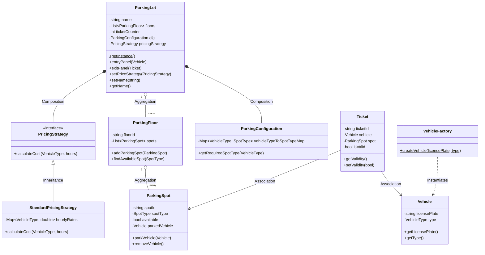
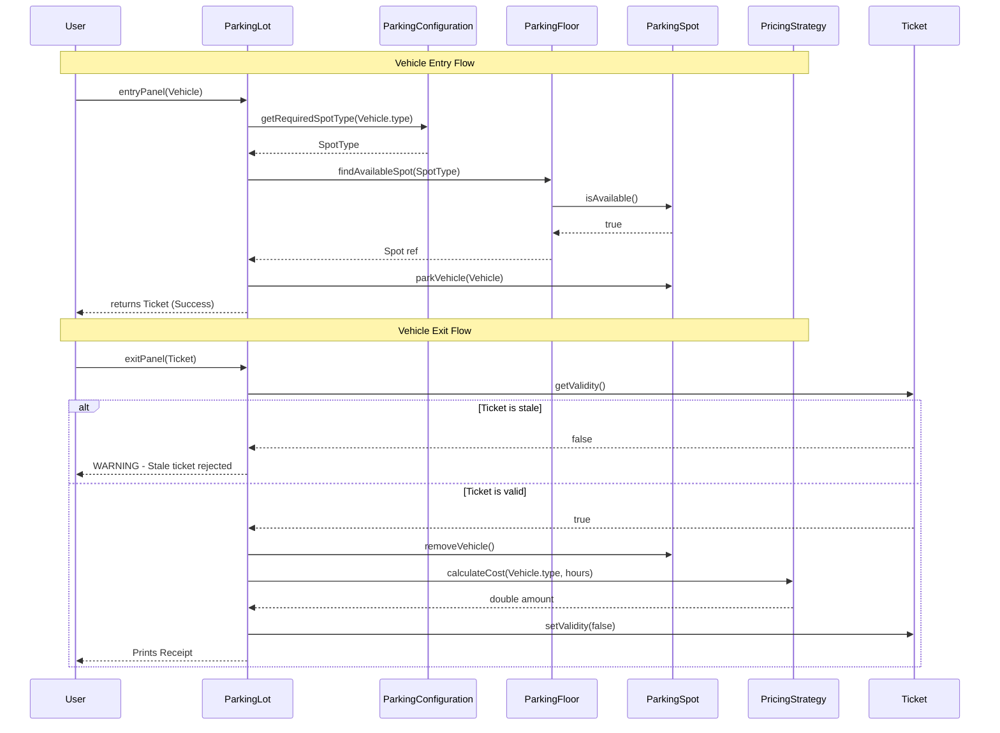

# Parking Lot Low-Level Design (LLD)

## 1. Requirements Gathering

### Functional Requirements

- **Parking Capacity Handling**: The parking lot should support multiple floors where each floor consists of several spots.
- **Vehicle Diversity**: The platform should comfortably support various vehicle types (e.g., Motorcycle, Car, Truck).
- **Logical Allocation**: Vehicles should be assigned to corresponding parking spot classifications (Motorcycle slots, Compact slots, Large slots).
- **Entry Registration**: Upon valid ingress, the system will allocate a spot and produce a verifiable Ticket mapped to the correct slot and vehicle.
- **Exit Finalization**: At check-out, the system retrieves the Ticket, de-allocates the spot, and calculates precise billing dependent on time spent and vehicle category.

### Non-Functional Requirements

- **Extensibility**: Permitting modular additions of newer spot definitions, vehicle subtypes, or dynamic calculation tactics.
- **Maintainability**: Sticking to clean Object-Oriented layouts mitigating cascading bugs upon modifications.
- **Robustness (No Threading issues)**: Preparing the architectural skeleton to potentially handle multi-barrier transactions simultaneously later if upgraded.

---

## 2. Entities & Relationships

### Core Entities

1. **Vehicle**: Immutable wrapper handling standard user assets (License Plate, Type).
2. **ParkingSpot**: Physical space descriptor retaining positional context, sizing constraints (SpotType), and dynamic state tracking (occupied vs vacant).
3. **ParkingFloor**: Regional aggregator clustering parking spots.
4. **Ticket**: Output payload certifying a contract between the Vehicle and ParkingSpot.
5. **ParkingConfiguration**: Matrix translating Vehicle needs to logical Spot properties.
6. **PricingStrategy**: Abstract algorithm container strictly handling computation of financial overheads.
7. **ParkingLot**: Grand facade encapsulating subsystems to provide entry/exit functionality cleanly tracking state.

### Relationships

- **Composition**: `ParkingLot` has a strictly rigid **Composition** relationship with `PricingStrategy` and `ParkingConfiguration`. The Lot inherently depends on these parameters for functionality and natively ties them to its lifecycle.
- **Aggregation**: `ParkingFloor` has an **Aggregation** relation with `ParkingSpot`. The floor groups them but it doesn't destructurally own a given concrete point of space inherently.
- **Inheritance**: `StandardPricingStrategy` extends `PricingStrategy` to provide standard rate-based calculations.

---

## 3. System Architecture & UML Class Diagram

This segment depicts the hierarchy mapping internal class dependencies leveraging robust composition and abstraction mappings.

---

## 4. Workflow Diagram

### Entry and Exit Control Flows

---

## 5. Exposing Component APIs Used

Interacting with the system leverages minimal, clean interfaces exposed over `ParkingLot`:

- `ParkingLot::getInstance()` - Bootstraps the singleton engine natively locking global variables.
- `setPriceStrategy(unique_ptr<PricingStrategy> &ps)` - Hot-swap pricing computation on the fly.
- `entryPanel(shared_ptr<Vehicle> &vehicle)` - Serves entry barrier; attempts allocation dynamically and issues a `shared_ptr<Ticket>`.
- `exitPanel(shared_ptr<Ticket> &ticket)` - Services the check-out barrier, computes and bills the receipt duration.
- `setName(string n)` / `getName()` - Allows the parking lot's display name to be updated and retrieved post-initialization.

---

## 6. Object-Oriented Design (SOLID) Validation

1. **Single Responsibility Principle (SRP)**No class is burdened with orthogonal requirements. `PricingStrategy` determines cost; `ParkingSpot` manages states; `ParkingFloor` resolves querying available spots.
2. **Open/Closed Principle (OCP)**Should dynamic holiday pricing become necessary, one merely inherits `PricingStrategy` to create `HolidayPricingStrategy` feeding it into the lot interface. Core routing is closed for alterations but open for implementations.
3. **Liskov Substitution Principle (LSP)**Any `PricingStrategy` derivate is perfectly integrable blindly substituting base abstractions.
4. **Interface Segregation Principle (ISP)** & **Dependency Inversion Principle (DIP)**
   Core classes like `ParkingLot` solely depend on abstract bases (e.g., `PricingStrategy`) and not concrete instances (e.g., `StandardPricingStrategy`).

---

## 7. Design Patterns Highlight

- **Singleton Pattern** `ParkingLot` implements local static initialization ensuring multiple gate barriers interact with a consistently singular source-of-truth ensuring spots are never double-booked.
- **Factory Method** `VehicleFactory` cleanly separates property injection scaling safely if database instantiation of previous configurations gets implemented.
- **Strategy Pattern**
  Enabled polymorphism decoupling financial computations. `PricingStrategy` ensures pricing bounds execute interchangeably.

---

## 8. Security Considerations

- **Stale Ticket Prevention**: Once a vehicle exits, its `Ticket` is immediately invalidated via `invalidate()`. Any subsequent attempt to re-use the same ticket at an exit panel is rejected with a warning, preventing a vehicle from being unparked twice or a spot from being incorrectly freed.
- **Entry Guard on Missing Payment Strategy**: `entryPanel` fails fast and returns no ticket if a `PricingStrategy` has not been configured, ensuring no vehicle enters the lot without a billing mechanism in place.
- **License Plate Validation**: `VehicleFactory` rejects empty license plates at creation time, preventing anonymous or malformed vehicles from entering the system.

---

### Why not Observer Pattern?

The Observer pattern is exceptionally proficient when states alter unexpectedly and multiple downstream components require immediate parallel alerts natively. In this architecture format, operations are solely synchronous transaction-to-transaction cycles initiated strictly by entry panels or exit panels. Spots becoming available don't mandate actively paging waiting clients in an event loop asynchronously; therefore rendering Observer unnecessary padding here.
